##  How can you define contention network?
* In contention networks, any node that has a packet to send, merely sends the packet
* It is clear that this type of network frequently experiences collisions
    * The more nodes trying to communicate, the higher the chance of collisions
    * Thus, contention networks are severely limited in the number of hosts possible

## What is carrier sense multiple access? Define carrier sensing hardware with diagram

* To reduce the number of collisions, the medium is tested for a signal before each transmission
    
    * If a signal exists, the node waits
    * Signal testing can be anything from detection of an
electrical signal, to testing for photons

* Collisions can still occur (although less often)
    * If a node tests for a signal before a transmission from another node, and transmits after, a collision occurs

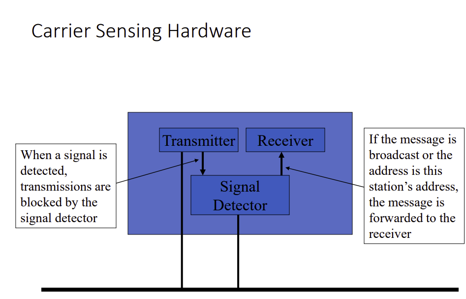

## Define the components of a router with diagram.
## Name and define the hardware components of a router. Show the router’s functional components using diagram.

### Hardware components of a router: 
* Network interfaces 
* Interconnection network 
* Processor with a memory and CPU

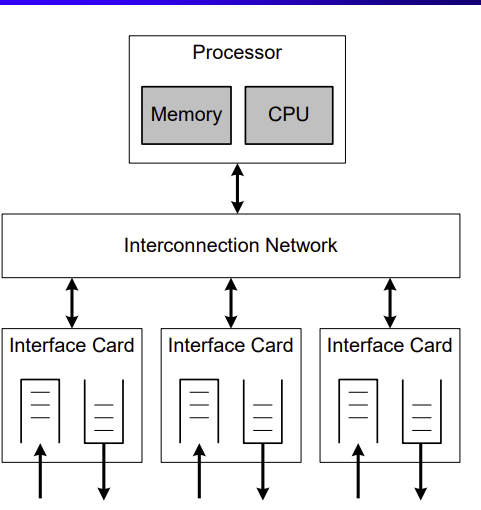
### Routing functions include:
* route calculation
* maintenance of the routing table
* execution of routing protocols

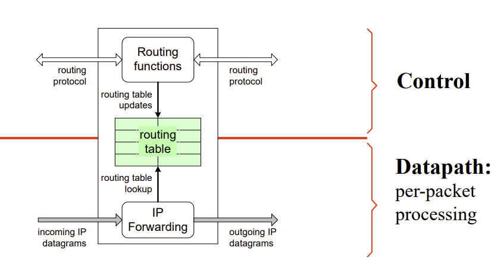

## “Routers have modularized network Interfaces”. Explain.

* One can add/remove/replace network interfaces as needs
change
* Some routers can accept network interface modules of
different types (e.g. Ethernet, Token Ring)
* Each network interface would have its own:
    * <b>Input buffer</b> : The incoming packets of a network interface are placed in
input buffers
    * <b>Routing Processor</b> :
        * Maintain and exchange routing data with other routers in the
network
        * Use the forwarding table data to configure the switching fabric to
forward the packet to the correct output port
    * <b>Output Buffer</b> : The packets are stored in the output buffer until the network is available

## What are the differences between hub, layer 2 and layer 3 switches? Explain with necessary diagram.

### Hub
* Extends distance by recreating the carrier wave on multiple ports
* Copies data to multiple ports even if its not necessary
* All ports are part of the same collision domain

### Layer 2 Switch
* Serves the same purpose as a hub
* Can dynamically determine if a frame should be placed on a port
* The data link layer (e.g. MAC) address is used to make this determination
* A table of MAC addresses and corresponding ports is built using incoming frames
* Only 2 hosts on the same LAN segment can have frame collisions

### Layer 3 Switch
* Uses layer 3 routing to determine a path for packets
* Once a path is found, subsequent packets are switched
    * This switching typically occurs on layer 2
    * These devices will be discussed in more detail later

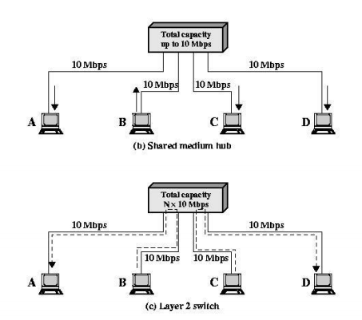

## Define packet tunneling in Internet with necessary diagram.

* The tunneling protocol works by using the data portion of a packet (the payload) to carry the packets that actually provide the service. Tunneling uses a layered protocol model such as those of the OSI or TCP/IP protocol suite, but usually violates the layering when using the payload to carry a service not normally provided by the network. Typically, the delivery protocol operates at an equal or higher level in the layered model than the payload protocol

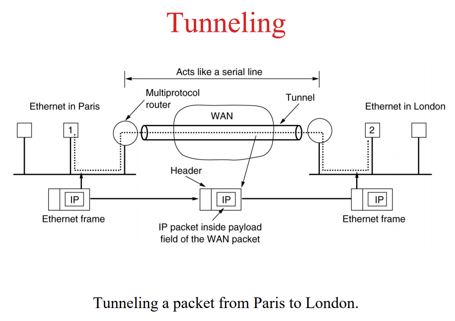

## What is shortest path routing? Find the shortest path from a source node to destination node.

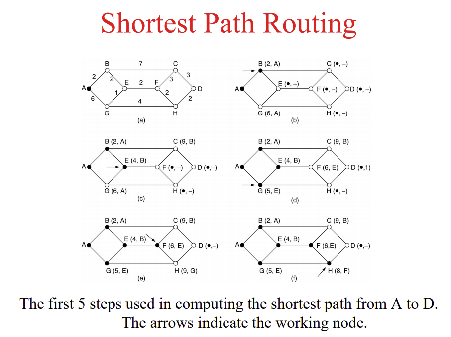

## Explain different types of packet fragmentation with diagram. Suppose a 19 byte packet to be transmitted along with 3 byte maximum segment length network. Show the segment numbering systems of the packet. The packet number is 15.

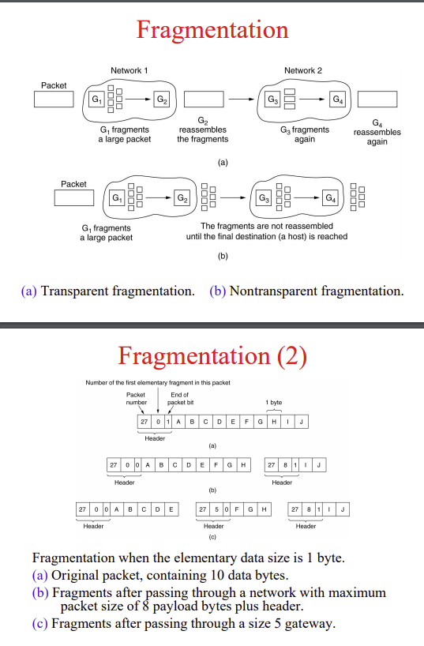

## Explain briefly the functions of Routing processor.

* Routing processors have two functions:
    1. Maintain and exchange routing data with other routers in the network Often this involves computing the forwarding table from data received by other routers

    2. Use the forwarding table data to configure the switching fabric to forward the packet to the correct output port

## Describe briefly the construction of routers of different generation with necessary diagram. 

### 1st Generation Routers
* This architecture is still used in low end routers
* Arriving packets are copied to main memory via direct memory access (DMA)
* Interconnection network is shared bus 
* All IP forwarding functions are performed in the central processor.
* Routing cache at processor can accelerate the routing table lookup

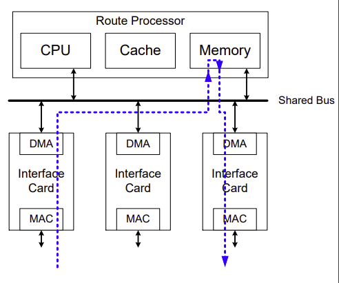

### 2nd Generation Routers
* Keeps shared bus architecture, but offloads most IP forwarding to interface cards
* Interface cards have local route cache and processing elements

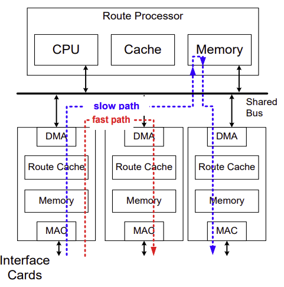

### 3rd Generation Architecture
* Interconnection network is a switch fabric (e.g., a crossbar switch)
* Distributed architecture:
    * Interface cards operate independently of each other
    * No centralized processing for IP forwarding
* These routers can be scaled to many hundred interface cards and to aggregate capacity of > 1 Terabit per second

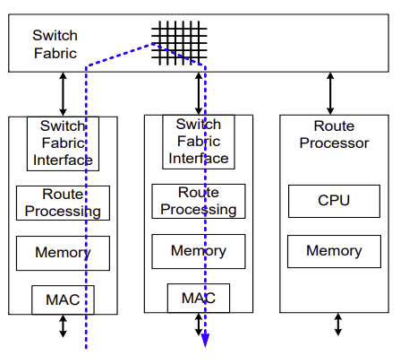

## Describe the routing protocol for mobile host with necessary diagram.

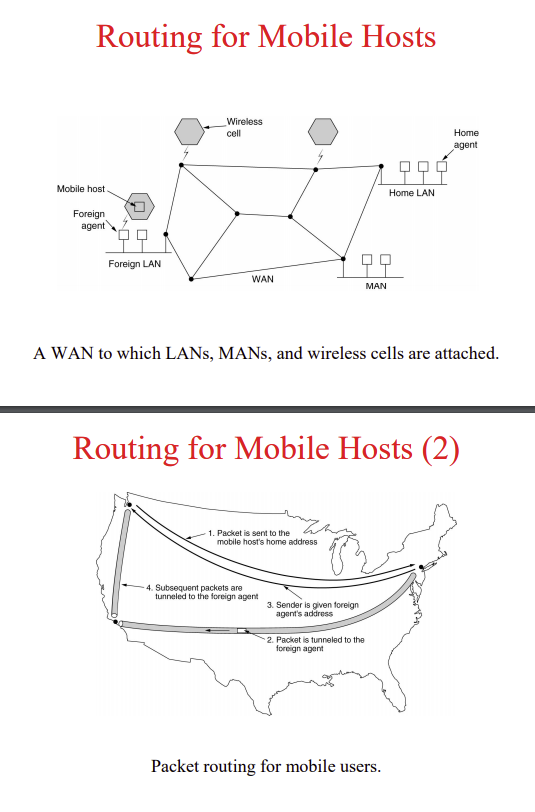

## How can you define TCP/IP tunneling over ATM? Explain the categories of services that ATM provides. 
* TCP/IP tunneling allows transmission of TCP/IP packets over ATM (and other non-TCP/IP) networks
* The use of TCP/IP over these networks allows applications which normally only run on TCP/IP networks to operate on all networks

* ATM provides 4 service categories:
    * <b>CBR (Constant Bit Rate):</b> A constant bandwidth is reserved and guaranteed by the network
    * <b>UBR (Unspecified Bit Rate):</b> Data is transmitted when bandwidth is available, and not when bandwidth is not available
    * <b>ABR (Available Bit Rate):</b> The network will provide feedback about network congestion, under the assumption the node will adjust its transmission to meet the current availability of network bandwidth
    * <b>VBR (Variable Bit Rate):</b> A minimum bandwidth is reserved and guaranteed by the network, although available bandwidth may increase/peak above this value
        * <b>RT (Real Time):</b> Fluctuation of bandwidth is minimized
            * Used for non-guaranteed streaming audio/video
        * <b>NRT (Non Real Time):</b> Any bandwidth available is used
            * Used for downloads

## What is distance vector touting? Explain with example.
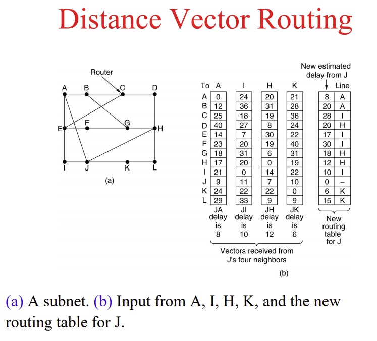

## Explain hierarchical routing with necessary example. 
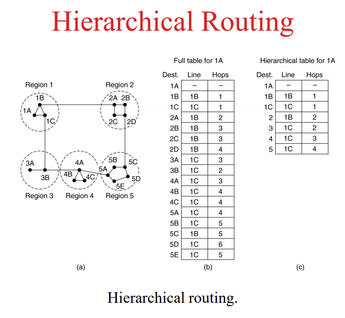

## What is ATM network? Define the logical connections used in ATM networks.

* Use optical fibre similar to that used for FDDI networks
    * ATM runs on network hardware called SONET
* ATM cells (packets) are 53 octets long
    * 5 bytes of header information
    * 48 bytes of data
* ATM networks are packet-switched, but still create a (virtual) circuit through the network
    * Before transfer can occur, the network must create a path (called a virtual circuit) between the two machines
    * Once the virtual circuit (VC) has been established, packets can be transferred between the machines

### Logical Connections
* <b>VCC (Virtual Channel Connection):</b> a logical connection analogous to virtual circuit in X.25
* <b>VPC (Virtual Path Connection):</b> a bundle of VCCs with same endpoints

## Explain ATM protocol architecture. Define ATM cell format.

* Fixed-size packets called cells
* <b>Streamlined:</b> minimal error and flow control
* 2 protocol layers relate to ATM functions:
    * Common layer providing packet transfers
    * Service dependent ATM adaptation layer (AAL)
* AAL maps other protocols to ATM

### ATM Cell Format: Data Cells
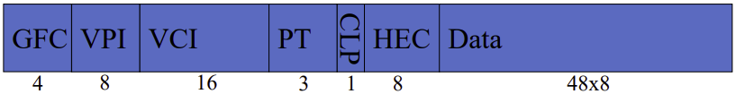

* <b>Generic flow control:</b> Control traffic flow.
* <b>Virtual path identifier:</b> An identifier for the virtual path/circuit
* <b>Virtual channel identifier:</b> An identifier to identify which channel within the specified virtual path/circuit
* <b>Payload Type:</b> 3 flag bits
* <b>Cell loss priority:</b> Should the cell be discarded in the event of a congested switch?
* <b>Header error check:</b> Cyclical redundancy check for the cell header

## Explain the ways of creating ATM virtual circuits.

* Creating a virtual circuit has been compared to making a telephone call
* A network node sends a request to the ATM switch specifying the destination
* The switch interacts with any other switches necessary to align themselves to form a complete path
* When communication is complete, the node sends a disconnect message to the switch
* The switch will then notify all switches involved to release the connection

## What do you mean by segmentation and reassembly in ATM network. Define ATM switching with necessary diagram.

### Segmentation

* Segmentation is the process of turning a chunk of
data into a group of ATM cells
    * For example, the chunk of data might be a packet from another type of network
        * e.g. An Ethernet frame
* Since ATM cells travel on the same virtual circuit, they do not arrive out of order
    * Thus sequencing information is not necessary
* Each sequence of 48 octets is sent in its own cell

### Reassembly

* Reassembly is the process of recombining ATM cells into the original
data chunk
* As the destination node receives cells, it removes the 48 octets and
appends it to the end of a buffer
* One of the configuration parameters, called ‘Payload Type’ is used to
indicate the final cell

## Name and define the network properties.

* <b>Scope:</b> A network should provide services to several applications
* <b>Scalability:</b> A network should operate efficiently when deployed on a small-scale as well as on a large-scale
* <b>Robustness:</b> A network should operate in spite of failures or lost data
* <b>Self-Stabilization:</b> A network, after a failure or other problem, should return to normal (or near normal) without human intervention
* <b>Auto Configurability:</b> A network should optimize its own parameters in order to achieve better performance
* <b>Safety:</b> A network should prevent failures as well as prevent failures from affecting other areas of the network
* <b>Configurability:</b> A network’s parameters should be configurable to improve performance
* <b>Determinism:</b> Two networks with identical conditions should yield identical results
* <b>Migration:</b> It should be possible to add new features to a network without disruption of network service

## Explain the TCP/IP protocol in action using a simplified network route. 
* Consider the following simplified network route
    * The source (S) and destination (D) are separated by two routers (R1, R2)

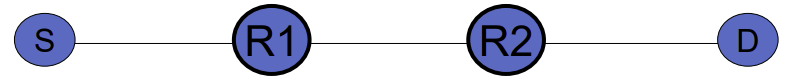

* Let’s consider a web browser, using HTTP
    * The web browser on S sends a packet to the web server on D
    * The application layer (i.e. the browser) provides the logical (IP) addresses for S (IPS) and D (IPD)
    * The application layer also provides the port numbers for the source (PortS) and destination (PortD)

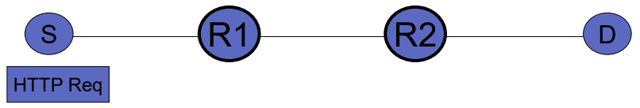

* The Transport layer (TCP) uses the port numbers (e.g. 2765 and 80) to create a TCP packet (sometimes called a segment):

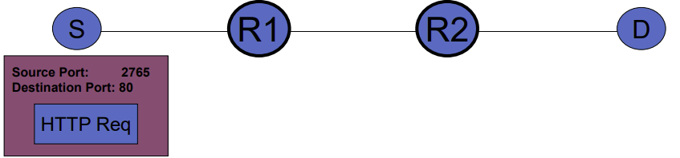

* The Internet (i.e. IP) layer uses the IP addresses specified by the application layer to create an IP datagram
    * e.g. 137.207.140.71, 24.87.204.16
    * Next, a route is determined for the packet, using S’s routing table
        * S only needs one router’s address (R1)

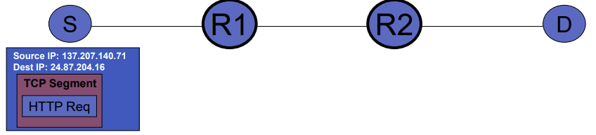

* The MAC addresses of S and R1 (MACS
and MACR1) are used to
create a network frame
    * If the MAC address of R1 is not known, ARP (address resolution protocol) is used

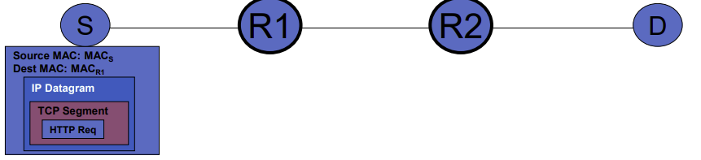

* Let’s simplify the picture (for clarity)
    * In subsequent steps the IP datagram and its contents will not change very much

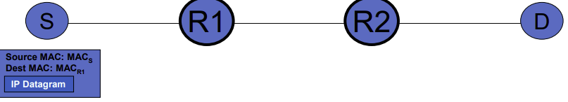

* The network frame is transmitted on the network to R1
    * This is possible since S and R1 are both members of the same network

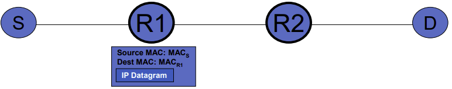
* R1 will extract the IP datagram from the payload of the network frame
* R1 looks up the destination IP address (IPD) in it’s routing table, to determine which router should get the datagram next (R2)

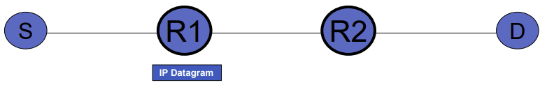

* R1 uses its own MAC address (MACR1) and R2’s MAC address
(MACR2) to create another network frame

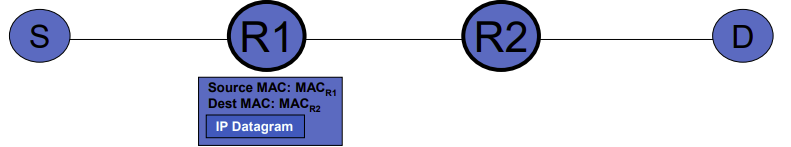

* The network frame is received by R2, and the IP datagram is extracted from it’s payload
* R2 uses its routing table to lookup IPD
    * In this case, R2 is directly connected to D
        * This is called direct routing

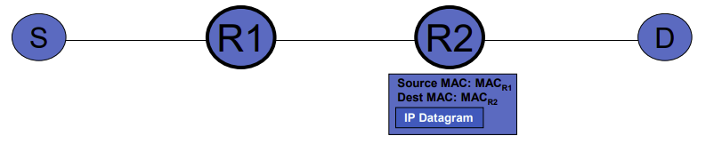
* Most likely, R2 does not have the MAC address of D (MACD)
    * The address resolution protocol (ARP) is used to determine the MAC address:

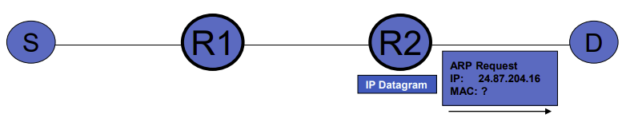

* D recognizes it’s IP address and responds with its MAC address (MACD)
    * e.g. 08-7F-3C-90-0C-DF

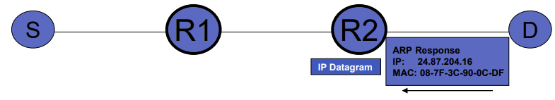
* A network frame is created by R2 now that the MAC address is known
* The frame is sent directly to D

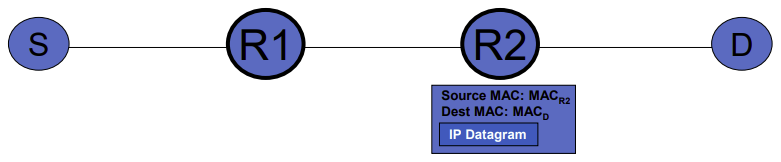
* D extracts the IP datagram from the network frame (which is discarded)
* The IP datagram’s payload is passed to the transport layer

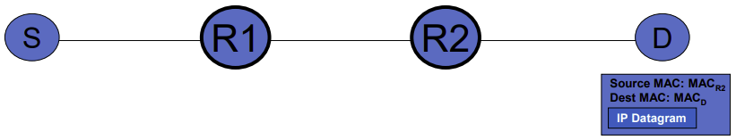
* The Transport layer (within D’s operating system), will use the port numbers specified in the TCP segment to determine to which application it should send the segment
    * In this case, to the application bound to port 80 (the web server)

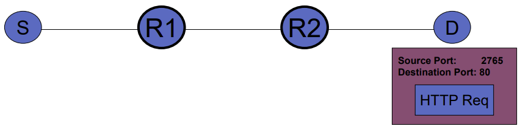

* Now, the web server on D has the HTTP request, and it processes it
    * An HTTP response is sent back using the same process
    * The web server uses the same IP addresses and logical addresses as the last message

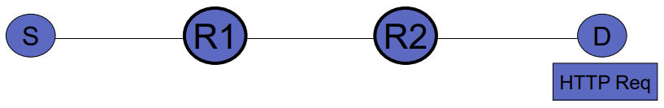

## Short notes on: router’s input buffer, output buffer, processor, switching fabric.

* Input buffers (one for each network interface):
    * Used to store incoming packets before they are processed
* Routing processor:
    * This is often software running on a CPU which:
        * Maintains and exchanges routing data with other routers
        * Controls the switching fabric to forward packets
    * With high-end routers, each network interface may have a local routing processor (for forwarding) so that each can forward the
packets in its own input buffer independently
* Switching fabric:
    * A network of connections between network interfaces (and their input and output buffers)
* Output buffers (one for each network interface):
    * Used to store outgoing packets after they are processed, but before the network is available for transmission

## What is switching? Write the reasons for switching in communication.

* Switching implies directing of information flows in communications networks based on known rules
* Switching takes place in specialized network nodes
* Data switched on bit, octet, frame or packet level
* Size of a switched data unit is variable or fixed

### Reasons for switching

* Switches allow reduction in overall network cost by reducing number and/or cost of transmission links required to enable a given user population to communicate
* Limited number of physical connections implies need for sharing of transport resources, which means
    * better utilization of transport capacity
    * use of switching
* Switching systems are central components in communications networks

## Describe the main building block of a switch. Define basic type of switching  networks.
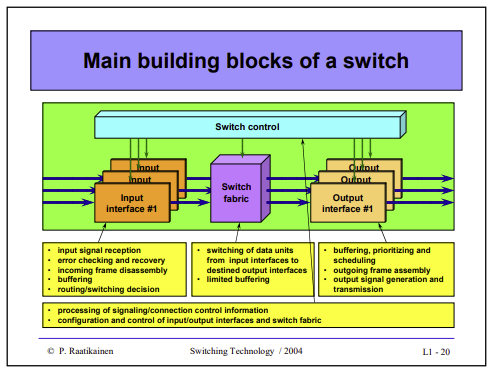

* Statically switched networks
    * connections established for longer periods of time(typically for months or years)
    * management system used for connection manipulation
* Dynamically switched networks
    * connections established for short periods of time (typically from seconds to tens of minutes)
    * active signaling needed to manipulate connections
* Routing networks
    * no connections established - no signaling
    * each data unit routed individually through a network
    * routing decision made dynamically or statically

## Explain different types of switching modes.  Define label switching.
* Circuit switching
    * End-to-end circuit established for a connection
    * Signaling used to set-up, maintain and release circuits
    * Circuit offers constant bit rate and constant transport delay
    * Equal quality offered to all connections
    * Transport capacity of a circuit cannot be shared
* Cell switching
    * Virtual circuit (VC) established for a connection
    * Data transported in fixed length frames (cells), which carry
    information needed for routing cells along established VCs
    * Forwarding tables in network nodes
    * Signaling used to set-up, maintain and release VCs as well as
    update forwarding tables
    * VCs offer constant or variable bit rates and transport delay
    * Transport capacity of links shared by a number of connections
    (statistical multiplexing)
    * Different quality classes supported
    * Applied, e.g. in ATM networks

* Packet switching
    * Routing
    * Layer 3 - 7 switching
        * L3-switching evolved from the need to speed up (IP based) packet routing
        * L3-switching separates routing and forwarding
        * A communication path is established based on the first packet associated with a flow of data and succeeding packets are switched along the path (i.e. software based routing combined with hardware based one)
        * <b>Notice:</b> In wire-speed routing traditional routing is implemented in hardware to eliminate performance bottlenecks associated with software based routing (i.e., conventional routing reaches/surpasses L3-switching speeds)
        * In L4 - L7 switching, forwarding decisions are based not only on M0AC address of L2 and destination/source address of L3, but also on application port number of L4 (TCP/UDP) and on information of layers above L4
    * Label switching
        * Evolved from the need to speed up connectionless packet switching and utilize L2-switching in packet forwarding
        * A label switched path (LSP) established for a connection
        * Forwarding tables in network nodes 